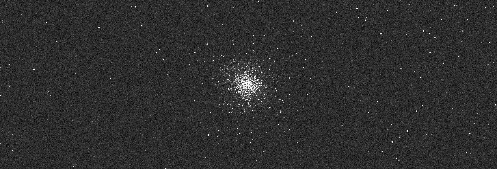

# Gaia Camera Simulator



This repositry creates a basic [ASCOM](https://www.ascom-standards.org/) Alpaca Camera driver that simulates the night sky using the [Gaia DR2 catalog](https://www.cosmos.esa.int/web/gaia/dr2) and its photometry.  It requires an Alpaca based telescope driver to be running and connected to the simulator (via [config.yml](src/config.yml)).  
When an image is requested, the simulator will:
1. request the telescope's current (ra, dec) coordinates.
2. call Gaia (or [local db](https://github.com/ppp-one/gaia-tmass-sqlite)) to get the stars in the field of view.
3. calculate the flux of each star in the field of view.
4. add noise to the image based on the photon flux from stars, sky background, and camera noise.
5. return the image to the client.

The simulator also has the option of adding scattered sunlight to the image for simulating sky flats. Similarly, one can add (ra, dec) coordinate errors to simulate pointing errors and poor tracking.

## Install
```
git clone https://github.com/ppp-one/gaia-camera-simulator.git
cd gaia-camera-simulator
conda env create -f environment.yml
```

## Run

First start the alpaca telescope simulator -- see [simulators](https://github.com/ASCOMInitiative/ASCOM.Alpaca.Simulators) or [ASCOM Remote](https://github.com/ASCOMInitiative/ASCOMRemote). Then edit the [config.yml](src/config.yml) file to point to the telescope simulator.  Then run the camera simulator:

```
cd src
uvicorn openapi_server.main:app --host 0.0.0.0 --port 8080 --log-level warning
```

## Test

Then use the following [example.py](example.py) to test the simulator, snippet below:

```python
# connect to telescope
telescope = Telescope(config['TELESCOPE_IP'], config['TELESCOPE_DEVICE_NUMBER'])
telescope.Connected = True

# connect to camera
camera = Camera('localhost:8080', 0)
camera.Connected = True

# move to target (M2)
# turn tracking on
telescope.Tracking = True
ra = 323.36152
dec = -0.82325
 
telescope.SlewToCoordinatesAsync(RightAscension=ra*24/360, Declination=dec)

# wait for slew to complete
while telescope.Slewing:
    print('Waiting for slew to complete...')
    time.sleep(0.5)

# start exposure
camera.StartExposure(1.0, True)

# wait for exposure to complete/image ready
while not camera.ImageReady:
    print('Waiting for image to be ready...')
    time.sleep(0.5)

# get image
img = camera.ImageArray
```
